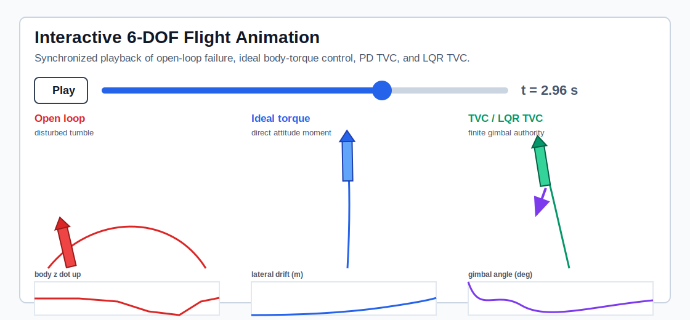
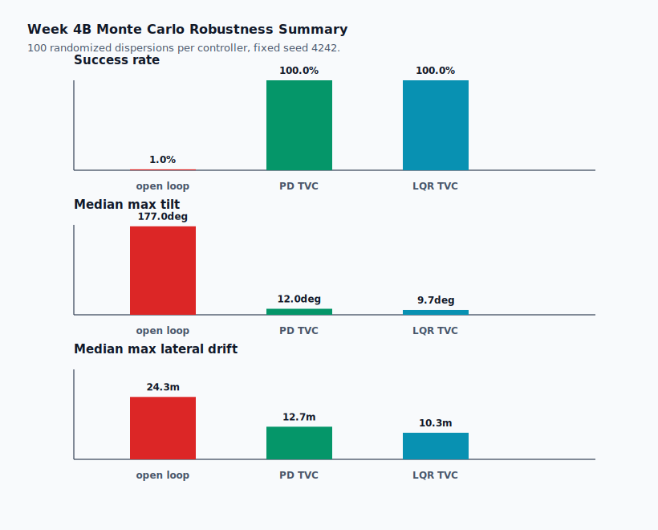
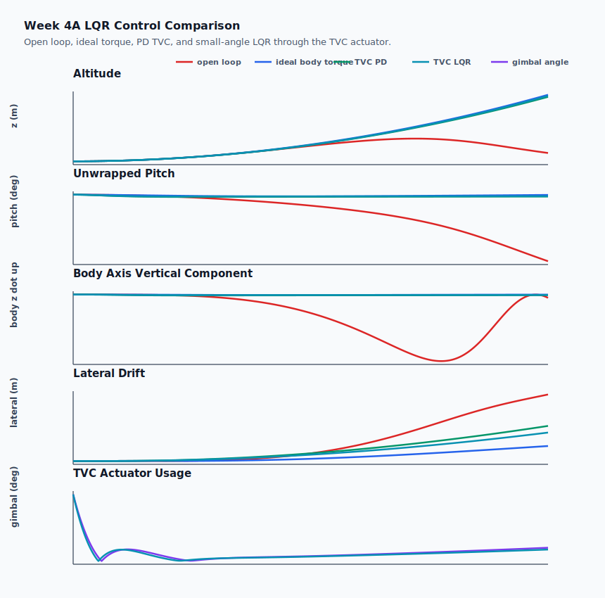
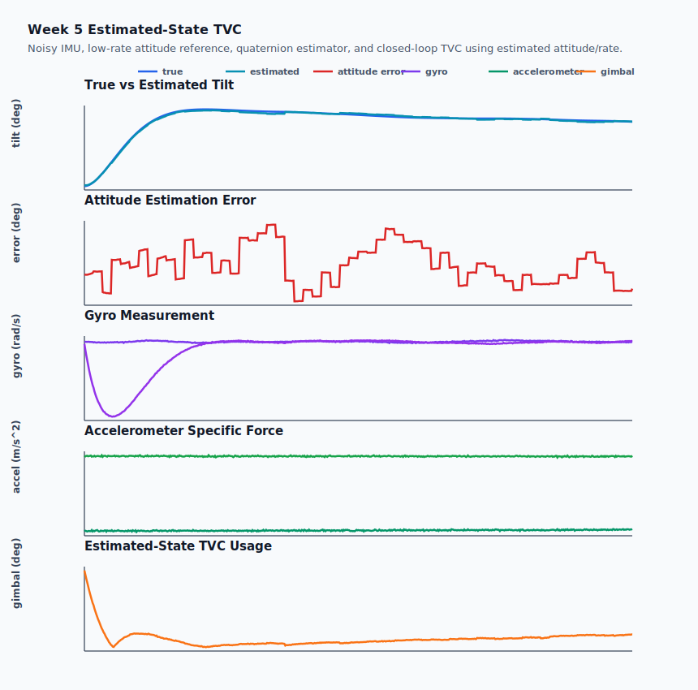
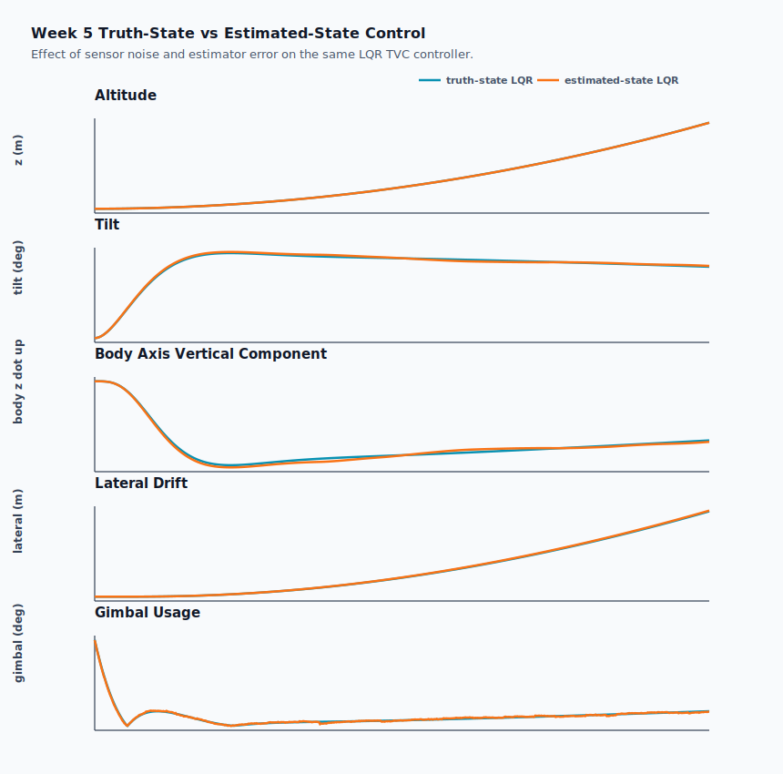
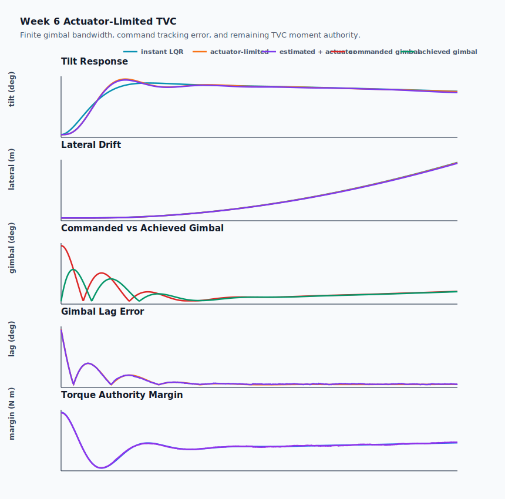

# 6-DOF Rocket Flight Simulator with TVC, LQR, and Monte Carlo Verification

[](https://github.com/flashgari/6dof-rocket-gnc-simulator/actions/workflows/test.yml)

This repository is a controls/GNC portfolio project for launch-vehicle ascent dynamics. It implements a nonlinear 6-DOF rigid-body rocket simulation, introduces aerodynamic and propulsion disturbances, demonstrates open-loop instability, stabilizes the vehicle with attitude feedback, allocates control through thrust vector control, compares PD and LQR control laws, adds sensor-based attitude estimation, checks finite-bandwidth TVC actuator dynamics, and verifies robustness with a Monte Carlo dispersion campaign.

The project is intentionally written as an engineering artifact: the code, plots, animation, tests, and writeups are organized so a reviewer can trace the work from first-principles dynamics to closed-loop verification.

## Engineering Summary

| Area | Implementation |
| --- | --- |
| Dynamics | 13-state nonlinear rigid-body model: inertial position, velocity, quaternion attitude, and body angular velocity |
| Integration | Fixed-step RK4 with quaternion normalization and sanity tests |
| Disturbances | Crosswind, thrust misalignment, thrust offset, drag, angle-of-attack normal force, and CP/CM moment arm |
| Control | Ideal body-torque PD, actuator-realistic PD TVC, LQR TVC, estimated-state LQR TVC, and actuator-limited LQR TVC |
| Actuation | TVC allocation, gimbal envelope, first-order servo lag, slew-rate limits, commanded-vs-achieved gimbal tracking, and torque-authority margin |
| Avionics | Noisy IMU model, low-rate attitude reference, quaternion attitude estimator, and sensor-driven feedback |
| Verification | Nominal controlled/uncontrolled comparisons, estimated-state control comparison, and 300-case Monte Carlo campaign |
| Presentation | SVG plots, CSV outputs, milestone reports, synchronized HTML animation, and upper-division physics explanations |

## Results At A Glance

Nominal disturbed ascent over a `3 s` simulation window:

| Case | Final altitude | Max tilt | Max lateral drift | Gimbal saturation |
| --- | ---: | ---: | ---: | ---: |
| Open loop | 3.99 m | 177.63 deg | 25.10 m | n/a |
| Ideal torque PD | 31.96 m | 9.88 deg | 5.65 m | n/a |
| PD TVC | 30.97 m | 12.94 deg | 13.24 m | 0.0% |
| LQR TVC | 31.43 m | 10.30 deg | 10.73 m | 0.0% |
| Estimated-state LQR TVC | 31.42 m | 10.43 deg | 10.83 m | 0.0% |
| Actuator-limited LQR TVC | 31.42 m | 11.09 deg | 10.67 m | 0.0% |
| Estimated actuator-limited LQR TVC | 31.43 m | 10.91 deg | 10.58 m | 0.0% |

Monte Carlo robustness campaign with `100` randomized dispersions per controller:

| Controller | Success rate | Median max tilt | Median max lateral drift | Worst max tilt | Worst lateral drift |
| --- | ---: | ---: | ---: | ---: | ---: |
| Open loop | 1.0% | 177.04 deg | 24.29 m | 179.82 deg | 27.74 m |
| PD TVC | 100.0% | 12.05 deg | 12.69 m | 22.88 deg | 23.56 m |
| LQR TVC | 100.0% | 9.67 deg | 10.35 m | 17.92 deg | 19.10 m |

## Visual Evidence

The figures are meant to show a full GNC argument, not only attractive plots. The open-loop case establishes the failure mechanism: small thrust-vector and aerodynamic disturbances create body moments, the angular rate grows, the thrust axis rotates away from inertial vertical, and the vehicle begins spending engine impulse on lateral and eventually downward acceleration. The controlled cases then show what changes when feedback torque is introduced and when that torque is constrained by a real TVC geometry.

## Interactive Flight Animation

The project includes a standalone HTML animation generated from the simulator CSV outputs:

[Open the animation artifact](outputs/rocket_flight_animation.html)

The animation compares open-loop failure, ideal body-torque control, PD TVC, and LQR TVC on a synchronized timeline. It shows the rocket attitude, trajectory, body-axis vertical alignment, lateral drift, and gimbal usage in one viewer. This matters because the failure is fundamentally coupled: attitude error is not just an angular quantity, it changes the direction of the thrust force in the translational equations.



In the open-loop lane, the vehicle may visually pass through an upright-looking attitude after tumbling, but that is not recovery. The unwrapped pitch history and `body_z_z` metric show that the thrust axis has already passed through horizontal and inverted orientations. During that interval, vertical thrust authority collapses and lateral kinetic energy accumulates. The controlled lanes demonstrate the opposite behavior: feedback keeps `body_z_z` close to one, so most of the thrust remains available for ascent rather than crossrange motion.

## Monte Carlo Robustness

The Monte Carlo figure summarizes `100` randomized dispersions for each controller. The sampled uncertainties include wind, thrust alignment, mass, inertia, CP location, normal-force slope, and gimbal authority. This is more meaningful than a single nominal run because launch vehicle ascent is sensitive to coupled dispersions: a slightly different inertia changes angular acceleration, a different CP location changes aerodynamic moment arm, and a different wind changes angle of attack and dynamic pressure loading.



The open-loop success rate is `1.0%`, with median maximum tilt near `177 deg`, which means the representative uncontrolled case essentially tumbles into inverted flight. PD TVC and LQR TVC both reach `100.0%` success under the selected pass/fail gates, showing that feedback control is not merely tuned for one convenient trajectory. LQR TVC also reduces median maximum tilt from `12.0 deg` to `9.7 deg` and median lateral drift from `12.7 m` to `10.3 m` relative to PD TVC, indicating better transverse-mode regulation inside the same actuator envelope.

## Controller Comparison

The comparison plot separates three different engineering questions. Open loop answers, "What does the disturbed plant do without feedback?" Ideal body torque answers, "Can the attitude-control law stabilize the nonlinear rigid body if torque is available?" TVC answers, "Can the same stabilization objective be achieved when moment must come from tilting a thrust vector through a finite lever arm?"



The ideal-torque case reaches the cleanest trajectory because it applies moment without changing the net thrust direction. TVC is more physically realistic: it creates moment through `r_engine x F_thrust`, which necessarily introduces lateral force components. That is why TVC can have more lateral drift than ideal torque even when attitude is stabilized. LQR TVC improves over PD TVC in the nominal case because its feedback gains are selected from a state/control cost trade instead of independent proportional and derivative tuning, but the result is still checked in the nonlinear 6-DOF plant rather than only in the linear design model.

## Sensor-Based Attitude Estimation

The Week 5 result adds an avionics layer between the truth-state simulation and the TVC controller. The simulated IMU provides biased/noisy gyro and accelerometer measurements, while a quaternion estimator propagates attitude using gyro integration and corrects drift with a low-rate noisy attitude reference. This is a more realistic GNC architecture because the controller no longer receives perfect attitude and angular-rate truth.



The accelerometer is modeled as body-frame specific force, `f_B = R_IB(q)(a_I - g_I)`, not as a clean gravity direction. That distinction matters in powered ascent: the accelerometer is dominated by thrust and aerodynamic loading, so using it as a simple gravity-leveling sensor would be physically wrong. The estimator therefore uses gyro propagation for high-bandwidth attitude tracking and reference corrections to bound drift.



The estimated-state controller remains close to the truth-state LQR baseline: maximum attitude estimation error is `0.32 deg`, RMS attitude estimation error is `0.17 deg`, and gimbal saturation remains `0.0%`. The control implication is that sensor noise and bias are small enough, after estimation, that the TVC loop remains inside the modeled attitude corridor and actuator envelope.

## Actuator-Limited TVC

Week 6 adds finite TVC actuator dynamics. The controller can request a nozzle angle, but the plant only receives the achieved angle after first-order servo lag, slew-rate limiting, and the hard gimbal envelope:

```text
delta_dot_cmd = (delta_cmd - delta_act) / tau_servo
|delta_dot_act| <= delta_dot_max
|delta_act| <= delta_max
tau_TVC = r_engine x F(delta_act)
```



This is a controls-stability check, not just a mechanical add-on. Finite actuator bandwidth inserts phase lag between attitude error and corrective moment. If the nozzle moves too slowly, the controller applies torque to an older attitude/rate state, reducing damping and phase margin. In the nominal Week 6 case, actuator-limited LQR remains stable: maximum tilt is `11.09 deg` for truth-state feedback and `10.91 deg` for estimated-state feedback. The peak gimbal lag is about `1.50 deg`, rate limiting remains `0.0%`, and torque-authority margin remains positive. That means the controller is not relying on instant or impossible nozzle motion to preserve thrust-axis alignment.

## Review Path

| Start here | Purpose |
| --- | --- |
| [FIGURE_INDEX.md](FIGURE_INDEX.md) | Quick visual guide with numerical takeaways and physical interpretation |
| [PORTFOLIO_WRITEUP.md](PORTFOLIO_WRITEUP.md) | Polished project narrative suitable for a portfolio page |
| [docs/figure_results_interpretations.md](docs/figure_results_interpretations.md) | Upper-division explanation of every generated plot |
| [outputs/rocket_flight_animation.html](outputs/rocket_flight_animation.html) | Synchronized animation of open loop, ideal torque, PD TVC, and LQR TVC |
| [docs/week5_sensor_estimation.md](docs/week5_sensor_estimation.md) | Sensor-model and quaternion-estimator design notes |
| [docs/week6_actuator_dynamics.md](docs/week6_actuator_dynamics.md) | Finite-bandwidth TVC actuator and authority-margin explanation |
| [outputs/week4b_monte_carlo_results.csv](outputs/week4b_monte_carlo_results.csv) | Trial-by-trial robustness data |

## Flight Physics

This section summarizes the physical reasoning behind the simulator. The full plot-by-plot interpretation is in [docs/figure_results_interpretations.md](docs/figure_results_interpretations.md), but the governing ideas are included here so the README itself is understandable without opening every supporting file.

The central modeling choice is to treat ascent as a coupled attitude/translation problem. A rocket does not simply "go up" because the engine is firing; it goes up only while the thrust axis remains aligned with the desired inertial direction. Once a disturbance rotates the body, the same thrust magnitude produces a different inertial acceleration vector.

**Translational Dynamics**

`m r_ddot_I = R_BI(q) F_B + [0, 0, -mg]`

The simulator computes thrust and aerodynamic forces in the body frame, then rotates them into the inertial frame using the quaternion attitude. This is the key coupling between attitude and trajectory. If the body `z` axis points upward, thrust mostly contributes to altitude. If the body rotates sideways, the same engine force contributes to crossrange acceleration. If the vehicle tumbles through inverted attitudes, thrust can even oppose ascent. That is why attitude stabilization is not a cosmetic requirement; it is directly required for translational performance.

**Rigid-Body Rotation**

`I omega_dot_B + omega_B x (I omega_B) = tau_B`

The rotational dynamics use Euler's rigid-body equation in body coordinates. The `I omega_dot_B` term is the direct angular acceleration response to moment, while `omega_B x (I omega_B)` represents gyroscopic coupling between axes. Even for a simplified rocket body, this term matters once angular rates grow because torque and angular acceleration are not always collinear in the body frame. The controller therefore stabilizes a nonlinear rotational plant, not a scalar pitch-only toy model.

The state uses quaternions instead of Euler angles because the open-loop failure intentionally passes through large rotations and near-inverted attitudes. Euler angles would introduce coordinate singularities and angle wrapping ambiguity; quaternions keep the force rotation well-defined throughout the tumble. The plots use unwrapped pitch and body-axis vertical alignment to avoid falsely interpreting a post-tumble orientation as recovery.

**Aerodynamic Loading**

`qbar = 0.5 rho |v_rel|^2`

`F_N ~= qbar S C_N_alpha alpha`

Aerodynamic force is computed from relative wind, not inertial velocity alone. Crosswind changes the velocity seen by the vehicle, which changes angle of attack and therefore normal force. Because dynamic pressure scales with `|v_rel|^2`, aerodynamic loads become more important as the vehicle accelerates. A small attitude error at low speed may be mild, while the same angular error at higher relative velocity produces much larger aerodynamic side force.

The normal force acts through the center of pressure, while the equations of motion are taken about the center of mass. The resulting aerodynamic moment is approximately `(r_CP - r_CM) x F_N`. Depending on CP/CM ordering and sign convention, this moment can be restoring or destabilizing. In the disturbed open-loop case, the model is intentionally configured to demonstrate how an uncompensated aerodynamic/propulsive moment can drive attitude divergence.

**Thrust Projection**

`T_vertical = T cos(theta)`

`T_lateral = T sin(theta)`

These projection equations explain the shape of the altitude and lateral-drift plots. As tilt angle grows, the vertical thrust component decreases with `cos(theta)`, while lateral thrust grows with `sin(theta)`. Near `90 deg` tilt, the engine is mostly accelerating the vehicle sideways. Past `90 deg`, part of the thrust points downward. This is why the uncontrolled case reaches a low final altitude and large lateral drift even though the engine is still producing thrust.

The `body_z_z` metric used in the plots is a compact way to track this effect because it is the vertical component of the body thrust axis. Values near `1` mean thrust is aligned with inertial up. Values near `0` mean thrust is horizontal. Negative values mean the thrust axis is inverted. This is more physically meaningful than only looking at a wrapped pitch angle.

**Moment And TVC Authority**

`tau = r x F`

`tau_TVC = r_engine x F_thrust`

`tau_max,TVC ~= L T sin(delta_max)`

Every major disturbance and actuator in the project is a moment-arm problem. A thrust misalignment or thrust offset creates a moment because the force line of action does not pass perfectly through the center of mass. Aerodynamic normal force creates a moment because the center of pressure is displaced from the center of mass. TVC creates a corrective moment by intentionally tilting the thrust vector at an engine location below the center of mass.

The TVC authority estimate `L T sin(delta_max)` is important because it turns the controller from an abstract feedback law into an actuator-limited system. Increasing gain cannot create unlimited moment; once the gimbal limit is reached, the commanded torque cannot be fully realized. This is why the project tracks gimbal angle and saturation fraction. In the nominal and Monte Carlo results here, the controllers stabilize the vehicle without sustained saturation, which supports the claim that the response is feasible for the modeled actuator rather than only mathematically stabilized by unrealistic torque.

**PD Control Versus LQR**

The PD controller adds rotational stiffness and damping:

`tau_cmd = Kp e - Kd omega`

The proportional term commands torque against thrust-axis attitude error, while the derivative term damps angular-rate growth. This is a useful first controller because it makes the physical stabilization mechanism transparent.

The LQR controller is designed from a local small-angle model:

`theta_dot = omega`

`omega_dot = tau / I`

The `Q/R` weighting changes the trade between attitude/rate error and control effort. LQR is not treated as a global tumble-recovery proof; it is a local controller around upright ascent. The important verification step is therefore running the LQR command through the same nonlinear quaternion dynamics and TVC allocation used for the PD controller. Its lower tilt and lateral drift show improved local regulation, while the gimbal telemetry checks that the improvement does not come from ignoring actuator limits.

**Sensor Modeling And Estimated-State Feedback**

`omega_meas = omega_true + b_g + eta_g`

`f_meas = R_IB(q)(a_I - g_I) + b_a + eta_a`

`q_hat_dot = 0.5 q_hat [0, omega_meas - b_hat]`

Week 5 adds the distinction between truth-state control and estimated-state control. Gyro bias and noise corrupt angular-rate feedback, accelerometer measurements reflect powered-flight specific force, and attitude reference updates arrive at a lower rate than the dynamics integration. The controller therefore acts on `q_hat` and `omega_hat`, not on the true plant state. This tests whether estimation error remains small enough that the LQR TVC controller still preserves thrust-axis alignment without overusing gimbal authority.

**Actuator Dynamics And Stability Margin**

`delta_dot_cmd = (delta_cmd - delta_act) / tau_servo`

`|delta_dot_act| <= delta_dot_max`

`|delta_act| <= delta_max`

Instantaneous TVC hides an important closed-loop effect: the controller's requested moment is not necessarily the moment applied to the vehicle. A real gimbal has bandwidth, rate limits, and position limits. These limits create phase lag and amplitude loss between the requested lateral thrust vector and the achieved lateral thrust vector. Since pitch/yaw stabilization depends on timely corrective moment, actuator lag can reduce damping or destabilize an otherwise acceptable controller.

The Week 6 actuator diagnostics therefore track commanded gimbal, achieved gimbal, gimbal lag error, rate-limit fraction, position-limit fraction, and torque-authority margin. This connects the software controller to physical actuator feasibility. A positive margin under `tau_max,TVC ~= L T sin(delta_max)` means the controller's requested moment fits inside the modeled engine-gimbal authority. The nominal actuator-limited result shows a visible but bounded `1.50 deg` gimbal lag, no rate limiting, and stable thrust-axis alignment, so the LQR controller retains practical margin beyond the ideal-TVC assumption.

## How To Run

The project uses only the Python standard library.

```bash
python3 scripts/run_all.py
```

This regenerates simulations, plots, milestone reports, the animation HTML, the Monte Carlo campaign, and the test suite.

Run tests only:

```bash
python3 -m unittest discover -s tests
```

Current verification:

```text
Ran 33 tests
OK
```

## Primary Artifacts

| Artifact | Purpose |
| --- | --- |
| [figures/week4b-monte-carlo-robustness.svg](figures/week4b-monte-carlo-robustness.svg) | Recruiter-facing Monte Carlo robustness summary |
| [figures/rocket-animation-preview.svg](figures/rocket-animation-preview.svg) | README preview for the interactive rocket-flight animation |
| [figures/week4a-lqr-control-comparison.svg](figures/week4a-lqr-control-comparison.svg) | Open loop vs ideal torque vs PD TVC vs LQR TVC comparison |
| [figures/week5-estimated-state-tvc.svg](figures/week5-estimated-state-tvc.svg) | Recruiter-facing sensor, estimator, and estimated-state TVC diagnostics |
| [figures/week5-truth-vs-estimated-control.svg](figures/week5-truth-vs-estimated-control.svg) | Truth-feedback LQR vs estimated-feedback LQR comparison |
| [figures/week6-actuator-limited-tvc.svg](figures/week6-actuator-limited-tvc.svg) | Finite-bandwidth TVC actuator, gimbal lag, and torque-authority diagnostics |
| [outputs/rocket_flight_animation.html](outputs/rocket_flight_animation.html) | Synchronized animation of open loop, ideal torque, PD TVC, and LQR TVC |
| [outputs/week4b_monte_carlo_results.csv](outputs/week4b_monte_carlo_results.csv) | Trial-by-trial robustness data |
| [outputs/week5_estimated_tvc_plots.svg](outputs/week5_estimated_tvc_plots.svg) | Sensor, estimator, and estimated-state TVC diagnostic plots |
| [outputs/week5_estimated_vs_truth_control_plots.svg](outputs/week5_estimated_vs_truth_control_plots.svg) | Truth-feedback LQR vs estimated-feedback LQR comparison |
| [outputs/week6_actuator_limited_tvc_plots.svg](outputs/week6_actuator_limited_tvc_plots.svg) | Actuator-limited TVC comparison and authority-margin plots |
| [FIGURE_INDEX.md](FIGURE_INDEX.md) | Fast visual guide with numerical takeaways and physical interpretations |
| [docs/figure_results_interpretations.md](docs/figure_results_interpretations.md) | Upper-division explanation of every generated graph |

## Technical Scope

### Week 1: Dynamics Core

- 13-state rigid-body model: inertial position, inertial velocity, body-to-inertial quaternion, body angular velocity
- Quaternion attitude propagation
- Translational dynamics with thrust and gravity
- Rotational dynamics using Euler's rigid-body equation
- Fixed-step RK4 integration
- Conservation and sanity tests

### Week 2: Disturbances And Open-Loop Failure

- Crosswind and relative-wind calculation
- Thrust misalignment and thrust offset
- Aerodynamic drag
- Angle-of-attack normal force
- CP/CM aerodynamic moment
- Unwrapped attitude plotting to avoid false recovery after inverted flight

### Week 3A: Ideal-Torque Attitude Control

- Body-axis attitude error:

```text
e_I = z_body,I x z_cmd,I
tau_cmd,B = Kp e_B - Kd omega_B
```

- Bounded ideal body torque
- Controlled-vs-uncontrolled comparison
- Verification that the feedback law stabilizes the nonlinear rigid body before actuator allocation

### Week 3B: Thrust Vector Control

- TVC allocation through:

```text
tau_TVC = r_engine x F_thrust
```

- Engine lever arm
- Maximum gimbal angle
- Requested vs achievable torque telemetry
- Saturation tracking

### Week 4A: LQR Controller

- Small-angle linearized attitude model:

```text
theta_dot = omega
omega_dot = tau / I
```

- Infinite-horizon LQR feedback with `Q/R` state-error/control-effort trade
- Nonlinear verification through the same TVC actuator model

### Week 4B: Monte Carlo Robustness

- 100 deterministic randomized dispersions with fixed seed `4242`
- Open loop, PD TVC, and LQR TVC evaluated for each dispersion
- Randomized wind, mass, inertia, thrust, thrust alignment, CP location, normal-force slope, and gimbal authority
- Pass/fail gates for max tilt, final altitude, max lateral drift, and gimbal saturation

### Week 5: Sensor Simulation And Attitude Estimation

- Biased/noisy gyro model
- Specific-force accelerometer model
- Low-rate noisy attitude reference
- Quaternion attitude propagation and correction
- Estimated-state LQR TVC feedback
- True-vs-estimated attitude, rate, sensor, and gimbal plots

### Week 6: Actuator Dynamics And Control Authority

- First-order TVC gimbal response
- Maximum gimbal angle and slew-rate constraints
- Commanded vs achieved nozzle deflection
- Gimbal lag error and actuator saturation telemetry
- Required torque vs available `L T sin(delta_max)` TVC authority
- Truth-state and estimated-state actuator-limited LQR comparison

## Repository Layout

```text
rocket_sim/
  actuator_sim.py    actuator-limited closed-loop simulation loops
  actuators.py       finite-bandwidth TVC actuator model
  analysis.py        derived metrics and physical summary quantities
  control.py         ideal torque, TVC, and LQR controllers
  controlled_sim.py  ideal-torque closed-loop integration
  dynamics.py        force, moment, and 13-state derivative model
  integrators.py     RK4 integration
  math3d.py          vector and quaternion utilities
  models.py          State, RocketParams, Environment dataclasses
  sim.py             open-loop simulation loop
  tvc_sim.py         TVC closed-loop simulation loop
scripts/
  run_all.py
  run_week1_ascent.py
  run_week2_disturbed_ascent.py
  run_week3a_controlled_ascent.py
  run_week3b_tvc_ascent.py
  run_week4a_lqr_tvc_ascent.py
  run_week4b_monte_carlo.py
  run_week5_estimated_tvc_ascent.py
  run_week6_actuator_limited_tvc.py
  plot_outputs.py
  write_reports.py
  build_animation.py
tests/
  test_week1_dynamics.py
  test_week2_disturbances.py
  test_week3a_control.py
  test_week3b_tvc.py
  test_week4a_lqr.py
  test_week4b_monte_carlo.py
  test_week5_estimation.py
  test_week6_actuators.py
docs/
  technical_physics_notes.md
  figure_results_interpretations.md
  week1_equations.md
  week2_disturbance_model.md
  week3a_ideal_torque_control.md
  week3b_tvc_control.md
  week4a_lqr_control.md
  week4b_monte_carlo.md
  week5_sensor_estimation.md
  week6_actuator_dynamics.md
  animation_viewer.md
outputs/
  generated CSV, SVG, HTML, and milestone reports
figures/
  recruiter-facing copies of the main SVG plots
FIGURE_INDEX.md
  fast visual review guide for the main plots
```

## Limitations And Next Work

- Aerodynamics use a simplified normal-force model rather than full coefficient tables.
- Mass, inertia, and thrust are constant during the burn.
- TVC actuator dynamics use a simplified first-order servo model rather than hardware-specific actuator data.
- LQR is designed around the upright operating point and is not a global tumble-recovery controller.
- Future extensions: gyro-bias estimation, translational Kalman filtering, mass depletion, gain scheduling, and higher-fidelity atmosphere/aerodynamics.

## Interview Talking Points

- Why quaternions are used for large attitude excursions and tumble cases.
- How CP/CM offset produces aerodynamic moment through `(r_CP - r_CM) x F_N`.
- Why open loop loses altitude when `T cos(theta)` collapses.
- Why TVC couples attitude correction to lateral acceleration.
- Why ideal torque is useful for control-law verification but not actuator-realistic.
- Why LQR is local and must be verified in the nonlinear plant.
- Why Monte Carlo robustness is stronger evidence than one nominal trajectory.
- Why finite TVC bandwidth affects phase margin and moment authority.
