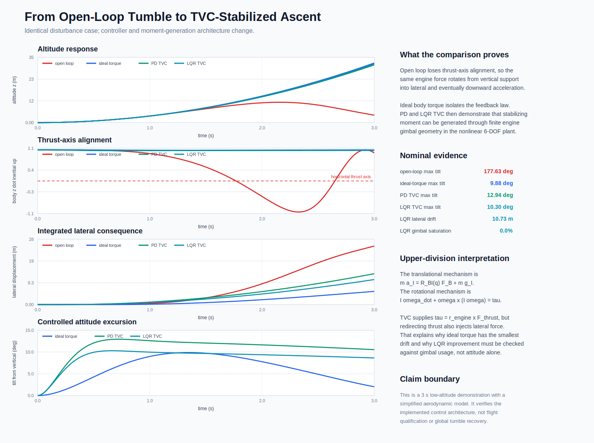
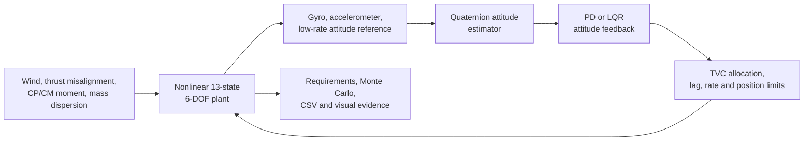
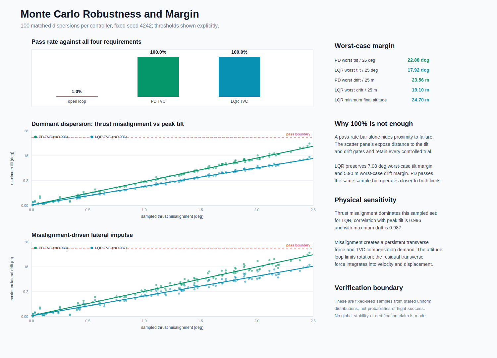
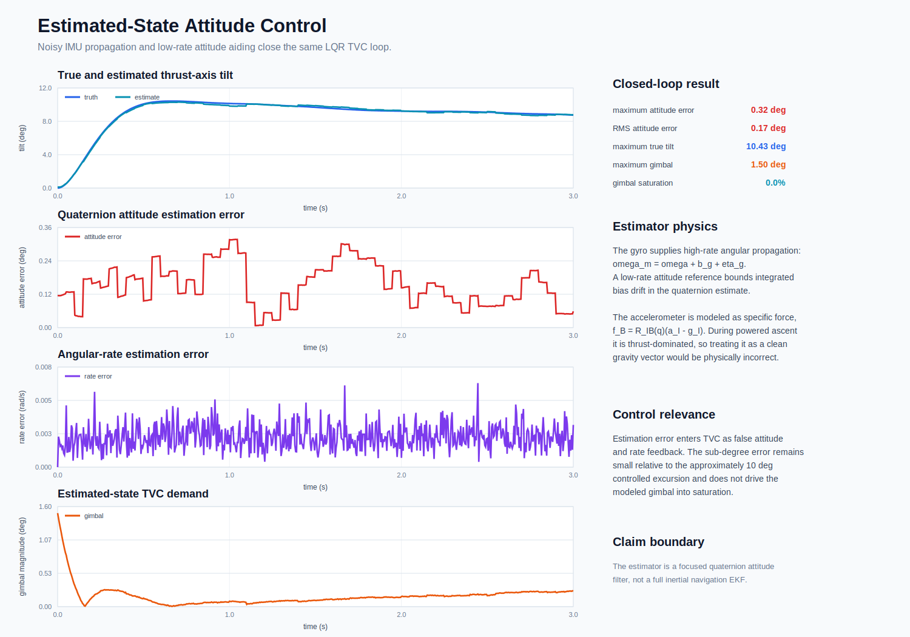
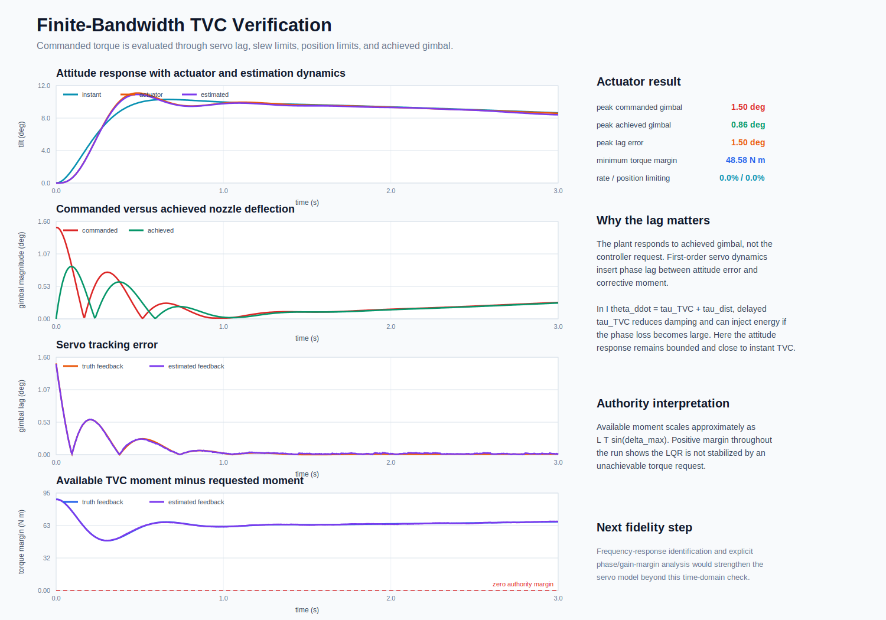
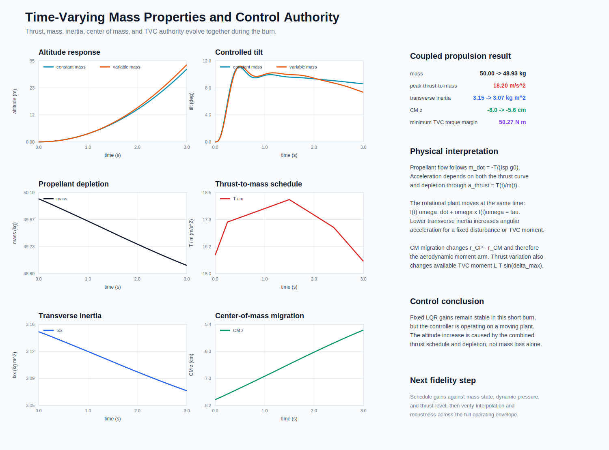

# Nonlinear 6-DOF Launch-Vehicle Ascent GNC

[](https://github.com/flashgari/6dof-rocket-gnc-simulator/actions/workflows/test.yml)

A first-principles Python simulation of disturbed launch-vehicle ascent, quaternion attitude estimation, PD and LQR feedback, thrust-vector-control allocation, finite-bandwidth gimbal dynamics, variable mass properties, and fixed-seed Monte Carlo verification.

**[Launch the synchronized flight animation](https://htmlpreview.github.io/?https://github.com/flashgari/6dof-rocket-gnc-simulator/blob/main/outputs/rocket_flight_animation.html)** | [Read the engineering report](PORTFOLIO_WRITEUP.md) | [Review every figure](FIGURE_INDEX.md)


The animation is generated from the same committed CSV histories used by the verification figures. Four vehicles are shown because they are matched simulations of one disturbed plant under four control architectures: red is open loop, blue is ideal body torque, green is PD TVC, and cyan is LQR TVC.

## Engineering Result

The central result is not simply that a controller reduces an angle. Without feedback, disturbance moments rotate the thrust axis through horizontal and nearly inverted orientations. The engine then redirects impulse away from inertial vertical, coupling attitude divergence into altitude loss and crossrange motion. Feedback arrests that rotational mode, while the TVC cases verify that the required moment can be produced through a gimbaled thrust vector rather than an unconstrained ideal torque source.



For the matched `3.0 s` low-altitude demonstration:

| Architecture | Maximum tilt | Final altitude | Maximum lateral drift | Gimbal saturation |
| --- | ---: | ---: | ---: | ---: |
| Open loop | 177.63 deg | 3.99 m | 25.10 m | n/a |
| Ideal body-torque PD | 9.88 deg | 31.96 m | 5.65 m | n/a |
| PD TVC | 12.94 deg | 30.97 m | 13.24 m | 0.0% |
| LQR TVC | 10.30 deg | 31.43 m | 10.73 m | 0.0% |

Ideal torque isolates the feedback law from actuator geometry. Its smaller drift is expected because it can apply a pure moment without canting the net force. TVC is the more physical control architecture: the engine develops moment through `r_engine x F_thrust`, so attitude correction necessarily consumes some lateral-force authority. LQR improves nominal tilt and drift relative to PD within the same nonlinear plant and gimbal model.

## GNC Architecture



The simulated state is

`x = [r_I, v_I, q_BI, omega_B]`, with `3 + 3 + 4 + 3 = 13` states.

The software separates dynamics, integration, control, actuation, estimation, propulsion, simulation orchestration, and analysis into testable modules under [`rocket_sim/`](rocket_sim/). The complete project regenerates from standard-library Python without third-party runtime dependencies.

## Flight Mechanics

### Coupled Translation and Rotation

The inertial translation model is

`m r_ddot_I = R_BI(q) F_B + m g_I`.

Thrust and aerodynamic forces are assembled in body coordinates and rotated into the inertial frame with the propagated quaternion. This rotation is the mechanism that converts attitude error into trajectory error. If `e_z,B . e_z,I = cos(theta)` falls toward zero, the thrust axis is horizontal and contributes essentially no vertical support. If it becomes negative, thrust opposes ascent.

Rotational motion follows Euler's rigid-body equation,

`I omega_dot_B + omega_B x (I omega_B) = tau_B`.

The cross product is retained, so the response includes gyroscopic cross-axis coupling rather than three independent scalar double integrators. Quaternions avoid the singularity and branch ambiguity that Euler angles would introduce during the intentional open-loop tumble. RK4 advances the state, and quaternion normalization controls numerical constraint drift.

### Aerodynamic and Propulsive Disturbance Moments

Relative wind, rather than inertial velocity alone, determines the aerodynamic state:

`v_rel,I = v_I - v_wind,I`

`q_bar = 0.5 rho ||v_rel||^2`

`F_N approximately q_bar S C_N_alpha alpha`.

The normal force acts at the center of pressure, producing

`tau_aero = (r_CP - r_CM) x F_N`.

Because `q_bar` grows quadratically with relative speed, the same angular perturbation can produce a much larger moment later in the ascent. Thrust-axis misalignment and force application away from the center of mass add propulsive moments. The open-loop trace is therefore an angular instability with a translational consequence, not an arbitrary scripted trajectory.

### Feedback and TVC Authority

PD feedback supplies rotational stiffness and damping,

`tau_cmd = K_p e_q - K_d omega`,

where the vector part of the shortest-path quaternion error defines the attitude correction. The LQR design uses a local pitch/yaw model near upright flight,

`theta_dot = omega`, `omega_dot = tau / I`,

and computes a state-feedback trade between angular error, rate, and control effort. It is not claimed as a global tumble-recovery law. Its validity is evaluated by closing it around the nonlinear quaternion plant and keeping the nominal response inside the local operating region.

TVC maps requested pitch/yaw moment into engine deflection:

`tau_TVC = r_engine x F_thrust(delta)`

`tau_max,TVC approximately L T sin(delta_max)`.

Controller gain alone cannot create moment beyond this envelope. The simulation therefore records commanded and achieved gimbal, position and slew limiting, and the difference between available and requested moment.

## Verification Evidence

### Robustness Is Reported as Margin, Not Only Pass Rate



The fixed-seed campaign applies the same `100` randomized dispersions to each architecture. Pass criteria are evaluated simultaneously:

- maximum tilt below `25 deg`
- final altitude above `20 m`
- maximum lateral drift below `25 m`
- gimbal saturation below `10%`

Open loop passes `1%` of trials. PD TVC and LQR TVC pass all `100` sampled trials, but the scatter plots are the more important evidence: they retain every controlled run and show distance to the tilt and drift boundaries. LQR's worst case is `17.92 deg` tilt and `19.10 m` drift, preserving `7.08 deg` and `5.90 m` of sampled worst-case margin. PD also passes, but its corresponding margins are only `2.12 deg` and `1.44 m`.

Thrust misalignment is the dominant sampled sensitivity. For LQR, its correlation with peak tilt is `0.996` and with peak drift is `0.987`. That result is physically consistent: persistent transverse thrust both demands compensating TVC moment and leaves a residual lateral force that integrates into velocity and displacement. These finite, prescribed samples establish regression evidence inside the stated uncertainty box; they are not a probability-of-flight-success or certification claim.

### Estimation Error Is Small Relative to the Controlled Excursion



The gyro provides high-rate quaternion propagation,

`omega_meas = omega + b_g + eta_g`,

while a lower-rate noisy attitude reference bounds integrated drift. The accelerometer is modeled as powered-flight specific force,

`f_B = R_IB(q) (a_I - g_I)`,

and is not treated as a clean gravity vector during thrusting. That distinction prevents an invalid stationary-platform attitude assumption from entering the ascent estimator.

The closed-loop maximum attitude-estimation error is `0.32 deg`, RMS error is `0.17 deg`, and maximum true tilt is `10.43 deg`. The sub-degree estimation error remains small relative to the controlled maneuver and does not drive gimbal saturation. This is a focused attitude filter, not a full translational inertial-navigation EKF; that claim boundary is intentional and explicit.

### Finite Actuator Bandwidth Preserves Damping and Authority



The plant responds to achieved nozzle deflection, not the controller request:

`delta_dot = sat_rate((delta_cmd - delta_act) / tau_servo)`

`|delta_act| <= delta_max`.

Servo lag introduces phase delay between sensed attitude error and corrective moment. Excessive delay would reduce rotational damping and can inject energy when the corrective torque arrives out of phase. Here the peak command is `1.50 deg`, the peak achieved deflection is `0.86 deg`, and the attitude response remains close to instantaneous TVC. The minimum available-minus-requested moment is `48.58 N m`; neither the rate nor position limiter is active. The controller is therefore not being stabilized in simulation by an impossible actuator request.

### The Plant Changes During Propellant Depletion



Propellant flow and acceleration obey

`m_dot = -T / (I_sp g_0)` and `a_thrust = T(t) / m(t)`.

Over the demonstration, mass decreases from `50.00 kg` to `48.93 kg`, transverse inertia from `3.15` to `3.07 kg m^2`, and center of mass moves from `-8.0 cm` to `-5.6 cm`. These changes affect both the disturbance plant and the control channel: `T/m` changes translational acceleration, lower inertia increases angular acceleration per unit moment, CM migration alters the CP/CM aerodynamic lever arm, and thrust level changes TVC moment authority.

The fixed LQR remains stable with a `50.27 N m` minimum torque margin and `11.21 deg` maximum tilt. This is evidence of margin over the short modeled burn, not a substitute for full-envelope gain scheduling. Scheduling against mass state, thrust, and dynamic pressure is the appropriate next control-law extension.

## Requirements and Traceability

The acceptance criteria, evidence artifacts, and automated checks are mapped in [VERIFICATION_MATRIX.md](VERIFICATION_MATRIX.md). The principal checks include:

| Requirement | Evidence |
| --- | --- |
| Quaternion state remains on the unit sphere | Dynamics tests and baseline CSV |
| RK4 integration preserves force-free invariants within tolerance | Dynamics unit tests |
| Disturbed open loop exhibits loss of thrust-axis alignment | Control-system evidence figure |
| Controlled cases remain inside attitude, altitude, drift, and saturation gates | Nominal metrics and Monte Carlo CSV |
| Estimated-state feedback remains stable under modeled sensor errors | Estimation evidence figure and tests |
| Achieved TVC remains within rate, position, and torque authority | Actuator evidence figure and tests |
| Variable mass, CM, and inertia evolve consistently with propellant depletion | Propulsion tests and variable-mass evidence |

There are `37` unit and integration tests covering math utilities, dynamics, disturbance response, control, TVC allocation, Monte Carlo reproducibility, estimation, actuator limits, and variable mass.

## Reproduce the Evidence

Requires Python `3.10+`; no third-party packages are required.

```bash
python3 scripts/run_all.py
```

This regenerates the nominal cases, `300` Monte Carlo trials, milestone reports, recruiter-facing figures, interactive animation, and then runs the full test suite.

Useful focused commands:

```bash
python3 -m unittest discover -s tests
python3 scripts/plot_recruiter_evidence.py
python3 scripts/build_animation.py
```

## Repository Guide

| Path | Contents |
| --- | --- |
| [`rocket_sim/dynamics.py`](rocket_sim/dynamics.py) | Nonlinear force, moment, quaternion, and rigid-body equations |
| [`rocket_sim/control.py`](rocket_sim/control.py) | Quaternion PD and local LQR feedback |
| [`rocket_sim/actuators.py`](rocket_sim/actuators.py) | TVC allocation, lag, slew, position, and authority logic |
| [`rocket_sim/sensors.py`](rocket_sim/sensors.py) | IMU errors and quaternion attitude estimator |
| [`rocket_sim/propulsion.py`](rocket_sim/propulsion.py) | Thrust curve, mass flow, CM, and inertia schedule |
| [`scripts/plot_recruiter_evidence.py`](scripts/plot_recruiter_evidence.py) | Deterministic SVG evidence generated from CSV histories |
| [`outputs/`](outputs/) | Committed CSV data, raw diagnostics, reports, and animation |
| [`tests/`](tests/) | Unit and integration verification |
| [FIGURE_INDEX.md](FIGURE_INDEX.md) | Plot-by-plot upper-division interpretation |
| [PORTFOLIO_WRITEUP.md](PORTFOLIO_WRITEUP.md) | Full technical narrative and design rationale |

## Model Boundaries

This is a portfolio-scale GNC demonstration, not flight-qualified software or a high-fidelity launch-vehicle prediction.

- The atmosphere uses a simplified low-altitude density model.
- Aerodynamics use compact drag and linear normal-force relationships rather than tabulated Mach/angle-of-attack coefficients.
- Structural flexibility, slosh, engine mount compliance, sensor alignment calibration, and navigation-state covariance are not modeled.
- The `3 s` case is intentionally short and low altitude; no max-Q, staging, Earth rotation, or orbital insertion claim is made.
- LQR is designed locally and then checked in the nonlinear plant; no global stability proof is claimed.
- Monte Carlo distributions are declared engineering test inputs, not validated flight uncertainty distributions.

These limits define the next useful work: linearization along the trajectory, gain scheduling, frequency-domain robustness with actuator/structure modes, a full error-state navigation filter, and aerodynamic coefficient tables tied to a stated vehicle geometry.
